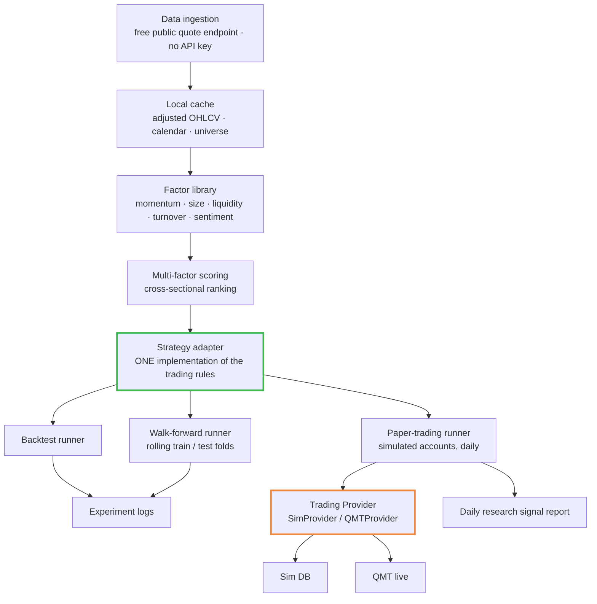

<h1 align="center">a-share-quant-sim</h1>

<p align="center">
  <b>A multi-factor quantitative research and paper-trading system for Chinese A-shares —<br/>
  the backtest and the simulated trader run through the same code path.</b>
</p>

<p align="center">
  <a href="LICENSE"></a>
  
  <a href="https://github.com/fkchaos/a-share-quant-sim/stargazers"></a>
  <a href="https://github.com/fkchaos/a-share-quant-sim/commits"></a>
  <a href="https://github.com/fkchaos/a-share-quant-sim/issues"></a>
  
</p>

<p align="center">
  <sub><b>Simulation and research only. This software places no real orders and is not financial advice.</b></sub>
</p>

<!-- Terminal recording (GIF, keep under 5 MB) goes here once produced. -->

---

## What this is

An end-to-end quantitative research stack for the Chinese A-share market: data ingestion →
factor computation → cross-sectional scoring → backtest → walk-forward validation →
**simulated** (paper) trading. Python, MIT licensed, and it goes from `git clone` to a
completed backtest on a clean machine in about five minutes.

The dependency tree is three packages — `pandas`, `numpy`, `requests` — and that is
the entire list. No quant framework to learn, no heavyweight backtester to fight.

It is a research instrument. It is not connected to a broker, it places no orders, and it
is not a signal service.

## Why this exists

Most quant setups drift into two codebases: a research one that produces the backtest, and
an execution one that actually trades. They start identical and then they diverge — a
liquidity filter gets patched on one side, a rebalance rule gets tightened on the other.
That drift is one of the quietest ways look-ahead bias gets in, because nothing ever fails
loudly. The numbers simply stop meaning what you think they mean.

Here there is **one** strategy adapter. The backtest runner, the walk-forward runner, and
the paper-trading runner all call into it. If a rule changes, it changes for all three, or
it does not change at all. That property is the reason this repository exists; everything
else is scaffolding around it.

## Quick start

```bash
git clone https://github.com/fkchaos/a-share-quant-sim.git
cd a-share-quant-sim

python3 -m venv .venv
source .venv/bin/activate          # Windows: .venv\Scripts\activate

pip install -e .

# Fetch the trading calendar and the stock universe, build the local cache
python3 scripts/tools/init_project.py

# Run a walk-forward backtest
python3 scripts/backtest/wf_runner.py --strategy v68
```

No API key, no account, no config file to fill in. Market data comes from a free public
quote endpoint. If you get through the four commands above and the backtest does not
complete, that is a bug and I would like an issue for it — "it runs on a clean machine" is
the one claim in this README I am willing to defend line by line.

> Outside mainland China the quote endpoint may be slow, rate-limited, or unreachable.
> See [Data source](#data-source) before you file an issue.

## Architecture



### The part that matters: one code path

```
                        ┌──────────────────────────────┐
   historical bars ────▶│                              │────▶ backtest / walk-forward
                        │      strategy adapter        │
                        │   (single implementation)    │
   today's bars    ────▶│                              │────▶ simulated account
                        └──────────────────────────────┘
                     same scoring · same filters · same sizing
                          · same entry and exit rules
```

The two runners differ only in **where the bars come from** and **what happens to the
resulting orders** — historical replay versus a simulated ledger. Neither of them owns a
copy of the trading rules. A strategy is a class implementing the adapter interface; the
runners are dumb.

This is a structural defence, not a promise. It removes the class of bug where research and
live disagree. It does not remove look-ahead bias you write into the factor code itself.

## What's inside

| Layer | What it does |
|---|---|
| Data | Ingestion, adjusted prices, trading calendar, universe construction, local cache |
| Factors | Reusable factor library (momentum, size, liquidity, turnover, sentiment) with an IC evaluation harness |
| Scoring | Cross-sectional multi-factor ranking, configurable weights |
| Strategies | Pluggable adapters. Two are currently running on two separate simulated accounts (`v61c`, `v75j`) |
| Trading | **Provider architecture**: SimProvider (paper) / QMTProvider (live via XunTou QMT, pending) |
| Validation | Backtest engine + walk-forward runner with rolling origin folds |
| Simulation | Daily paper-trading runner producing a research signal report |
| Docs | Deploy guide, user manual, architecture notes, full experiment logs |

### The parts most repositories don't ship

These three files are, honestly, the most useful things here:

- **[`docs/strategy/STRATEGIES_DISCARDED.md`](docs/strategy/STRATEGIES_DISCARDED.md)** —
  post-mortems for **26 strategies I falsified**, with the parameters, the reasoning, and
  what killed each one. Three are worth your time even if you never run the code:
  - A "buy yesterday's limit-up" strategy that looked like a runaway winner, until I
    excluded the names that opened at the daily price limit and never traded below it —
    trades you physically cannot fill. Same strategy, deep loss. That one recalibrated how
    much I trust any backtest number.
  - A strategy that looked fine over a handful of folds. Root cause: an `amount=0` field was
    silently zeroing the turnover and illiquidity factors. They were not erroring, they were
    quietly returning noise. After the fix and a proper fold count it collapsed to roughly flat.
  - A large batch of reversal / mean-reversion factor experiments in which essentially every
    reversal factor showed negative IC. In this market, at this horizon, the cross-section is
    momentum-continuation, not reversal. That is a real result, and it is the kind nobody
    publishes because it is not a win.
- **`ic_results_zz800.csv`** — the raw per-factor information-coefficient table computed over
  the CSI 1800 universe. Unpolished, and you are welcome to disagree with it.
- **[`docs/strategy/RESULTS_LOG.md`](docs/strategy/RESULTS_LOG.md)** — the running experiment
  log. **If you want performance figures, they are in here, in full methodological context.**
  I deliberately do not quote them in this README. A Sharpe ratio without its fold
  construction is worse than no number at all, and I would rather you read the caveat and the
  figure in the same paragraph.

One line from that log is worth surfacing: `v39g` worked, and the log records that it worked
**not because factor IC was high** — it was a hard momentum filter, small-cap exposure, and a
short holding period. My best result does not work for the reason you would assume.

## Validation, honestly

Walk-forward validation with a rolling origin: `train = 252` trading days, `test = 126`,
`step = 63`, **16 folds**, universe = CSI 1800, with warmup handled inside each training
window so no test-period data touches factor construction.

Three things you should know before you read any figure in the logs:

1. **The full-sample backtest is in-sample.** It is a fit, not a forecast. Treat it as an
   upper bound on what the rules can do, not as an expectation.
2. **The walk-forward result is out-of-sample, but it is a per-fold average.** Averaging
   per-fold Sharpe ratios over short test windows is not the same statistic as the Sharpe
   ratio of the pooled return series. Short windows structurally cannot contain a drawdown
   that spans a fold boundary.
3. **The folds overlap.** `step` is smaller than `test`, so the folds are not independent
   observations and the average is over-smoothed.

Taken together, those three points explain something that will otherwise look like a red
flag: across every strategy in the log, the walk-forward Sharpe reads *higher* than the
full-sample Sharpe. That is backwards from what any quant expects, and it is an artefact of
comparing two statistics that are not comparable. My own results log already says so:

> **"WF 是分段平均，全量回测才是真实表现；WF 扫描结果不等于全量回测结果。"**
> *The walk-forward number is a segment-by-segment average; the full-sample backtest is the
> real performance. A walk-forward scan result is not the same thing as a full-sample
> backtest result.*

I would rather tell you which number is which than have you find it in the log before I do.
If you think I should be pooling fold returns instead of averaging fold Sharpes, open an
issue — I would genuinely like a second opinion on that.

### Known limitations

- Transaction cost and slippage modelling is simple.
- Survivorship bias in universe construction is not fully handled.
- Limit-up fill realism was wrong before it was right (see the post-mortem above); the
  current strategy filters unfillable limit-up opens, but assume other fill assumptions are
  still optimistic.
- The framework is daily-frequency by construction and cannot express strategies that need
  intraday timing. One falsified strategy died partly for that reason.
- Capacity is limited. Small-cap, low-turnover results do not scale, and I have not modelled
  the point at which they stop working.

<details>
<summary><b>Understanding A-shares — a short primer for readers outside China</b></summary>

<br/>

If you have only ever modelled US equities, several rules here will break assumptions baked
into off-the-shelf backtest engines:

- **T+1 settlement.** Shares bought today cannot be sold until the next trading day. This is
  a hard restriction on same-day round trips — it is *not* the same thing as the US T+1
  clearing cycle, which does not restrict selling.
- **Hard daily price limits.** Each stock trades inside a fixed band around the previous
  close. The band width differs by board — main board is the tightest common case, the STAR
  Market and ChiNext are wider, and ST (Special Treatment, financially distressed) names are
  tighter still. Once a stock is pinned at the band edge, the order book on one side
  effectively empties and you may not get filled at all. This is the single biggest source of
  fake backtest profits in this market.
- **Frequent trading suspensions.** Individual names can be halted for days or weeks.
- **Retail-dominated volume.** Momentum, sentiment, and turnover factors behave differently
  than in institution-dominated markets.
- **Trading hours** 09:30–11:30 and 13:00–15:00 China Standard Time (UTC+8), Monday to
  Friday, minus mainland public holidays.
- **Access.** Non-residents generally cannot trade A-shares directly (Stock Connect, QFII,
  ADRs, ETFs). This repository is a research tool, not a trading gateway — the value to you
  is the architecture and the market microstructure, not the market access.

</details>

<details>
<summary><b>FAQ</b></summary>

<br/>

**Can I trade real money with this?** Migration to XunTou QMT live trading is in progress. The Provider architecture is ready; QMTProvider will be implemented once the brokerage integration path is confirmed. Currently paper trading only.

**Can I use it for US or other markets?** The architecture is market-agnostic; the data layer
is A-share specific. You would need to replace the ingestion adapter and relax the T+1 and
price-limit constraints in the execution model. A pluggable data-provider layer is a wanted
contribution.

**Why A-shares?** Free data with no API key, genuinely unusual market microstructure, and
personal interest. The constraints made it a more interesting engineering problem than a
market where you can assume you always get filled.

**Does it work outside mainland China?** Partly — see below.

**Where are the performance numbers?** In `docs/strategy/RESULTS_LOG.md`, with their
methodology attached. Read the "Validation, honestly" section first.

</details>

## Data source

Market data uses a **pluggable Provider architecture** with automatic fallback:

| Provider | Source | Pros | Cons |
|----------|--------|------|------|
| **Tencent** (primary) | `qt.gtimg.cn` | Free, no API key, fast | No turnover rate, no ST/status flags |
| **BaoStock** (backup) | `baostock.com` | Free, has turnover + ST + status | Requires login, slower |

**Auto-fallback**: If primary fails, the system automatically switches to backup.
**Manual override**: Set `override` in `config/data_sources.yaml` to force a specific provider.

> 📖 See `docs/DEPLOY.md` for configuration details and `docs/ARCHITECTURE.md` for the provider design.

## Documentation

| Document | Contents |
|---|---|
| `docs/ARCHITECTURE.md` | System design, module boundaries, data flow |
| `docs/DEPLOY.md` | Deployment and the daily scheduled run |
| `docs/USER_MANUAL.md` | Day-to-day usage |
| `docs/TESTING.md` | Standard tests + Golden Test regression suite |
| `docs/strategy/STRATEGY_REGISTRY.md` | Strategy catalogue and what each one tries |
| `docs/strategy/RESULTS_LOG.md` | Full experiment log, with figures and their caveats |
| `docs/strategy/STRATEGIES_DISCARDED.md` | Falsified strategies and post-mortems |

## Contributing

Issues and pull requests are welcome, in English or Chinese. Start with
[`CONTRIBUTING.md`](CONTRIBUTING.md) and the
[`good first issue`](https://github.com/fkchaos/a-share-quant-sim/labels/good%20first%20issue)
label.

Contributions that would help most right now:

- A pluggable data-provider adapter (`akshare` / `baostock` / `tushare`)
- A more realistic cost and slippage model
- English docstrings on the public API surface
- Independent review of the walk-forward fold construction

Please keep discussion technical. This repository does not take questions about what to buy,
and issues asking for stock recommendations will be closed.

## License

MIT — see [`LICENSE`](LICENSE).

## Disclaimer

> ⚠️ **`a-share-quant-sim` is an open-source project for quantitative research and *simulated*
> (paper) trading. It is released under the MIT License with no warranty. It does not place
> real orders, is not connected to any brokerage, and is not a financial product or service.**
>
> **Nothing in this repository, or in any content associated with it, is investment, financial,
> legal, or tax advice, nor a recommendation to buy or sell any security. The daily signal
> report is research output, not a recommendation.**
>
> **All backtest and walk-forward figures are historical simulations produced on historical
> data. They are not indicative of, and provide no guarantee of, future results. Markets
> involve risk of loss, including loss of principal. Consult a licensed professional before
> making any investment decision.**
