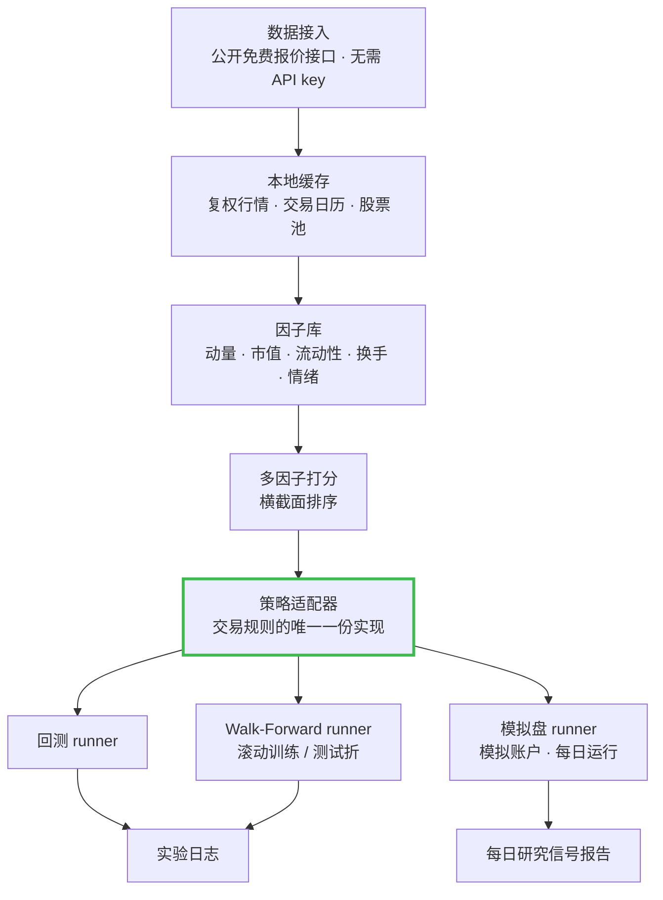

<h1 align="center">a-share-quant-sim</h1>

<p align="center">
  <b>面向 A 股的多因子量化研究与模拟交易系统 ——<br/>
  回测与模拟盘走同一条代码路径。</b>
</p>

<p align="center">
  <a href="LICENSE"></a>
  
  <a href="https://github.com/fkchaos/a-share-quant-sim/stargazers"></a>
  <a href="https://github.com/fkchaos/a-share-quant-sim/commits"></a>
  <a href="https://github.com/fkchaos/a-share-quant-sim/issues"></a>
  
</p>

<p align="center">
  <sub><b>仅用于模拟与研究。本项目不下真实委托，不构成任何投资建议。</b></sub>
</p>

<!-- 终端录屏 GIF（≤5MB）产出后放在这里 -->

---

## 这是什么

一套完整的 A 股量化研究链路：数据接入 → 因子计算 → 横截面打分 → 回测 → Walk-Forward 验证 →
**模拟盘**交易。Python 实现，MIT 协议，在一台干净机器上从 `git clone` 到跑完一次回测大约五分钟。

依赖树只有三个包——`pandas`、`numpy`、`requests`——这就是全部。没有要学的量化框架，也没有要对抗的笨重回测器。

它是研究工具。不接券商，不下单，也不是任何形式的信号服务。

## 为什么要做这个

大多数量化项目最后都会分裂成两套代码：一套做研究、出回测，一套跑实盘。它们一开始是一样的，
然后开始漂移——这边补了个流动性过滤，那边改了个调仓规则。这种漂移是前视偏差最安静的入口，
因为它从不报错，只是让你的数字慢慢失去它本来的含义。

这个项目里只有**一个**策略适配器。回测 runner、Walk-Forward runner、模拟盘 runner 全部调用它。
规则改一次，三处同时生效，要么就都不改。这条性质是这个仓库存在的理由，其余部分都是围绕它搭的脚手架。

## 快速开始

```bash
git clone https://github.com/fkchaos/a-share-quant-sim.git
cd a-share-quant-sim

python3 -m venv .venv
source .venv/bin/activate          # Windows: .venv\Scripts\activate

pip install -e .

# 拉取交易日历与股票池，建立本地缓存
python3 scripts/tools/init_project.py

# 跑一次 Walk-Forward 回测
python3 scripts/backtest/wf_runner.py --strategy v68
```

不需要 API key，不需要注册账号，没有要填的配置文件。行情走公开免费的报价接口。

如果上面四条命令跑不通，那就是 bug，请开 issue——"能在干净机器上跑起来"是本 README 里
我唯一愿意逐行辩护的断言。

## 架构



### 最关键的一点：同一条代码路径

```
                        ┌──────────────────────────────┐
      历史行情  ───────▶│                              │────▶ 回测 / Walk-Forward
                        │         策略适配器           │
                        │      （唯一一份实现）        │
      当日行情  ───────▶│                              │────▶ 模拟账户
                        └──────────────────────────────┘
                     同一套打分 · 同一套过滤 · 同一套仓位
                            · 同一套买卖规则
```

两个 runner 的差别只有两处：**行情从哪来**，以及**产生的委托流向哪里**——历史回放，还是模拟账本。
它们都不持有交易规则的副本。一个策略就是实现了适配器接口的类，runner 本身是"哑"的。

这是**结构性防御，不是承诺**。它消灭的是"研究与实盘不一致"这一类 bug，消灭不了你自己写进因子代码里的前视偏差。

## 里面有什么

| 层 | 做什么 |
|---|---|
| 数据 | 接入、复权、交易日历、股票池构建、本地缓存 |
| 因子 | 可复用因子库（动量、市值、流动性、换手、情绪）+ IC 评估工具 |
| 打分 | 横截面多因子排序，权重可配 |
| 策略 | 可插拔适配器。当前有两个策略在两个独立模拟账户上运行（`v61c`、`v75j`） |
| 验证 | 回测引擎 + 滚动起点的 Walk-Forward runner |
| 模拟 | 每日模拟盘 runner，产出研究信号报告 |
| 文档 | 部署指南、使用手册、架构说明、完整实验日志 |

### 大多数仓库不会放出来的三个文件

说实话，这三个文件是这里最有用的东西：

- **[`docs/strategy/STRATEGIES_DISCARDED.md`](docs/strategy/STRATEGIES_DISCARDED.md)** ——
  **26 个被我证伪的策略**的完整复盘，含参数、推理过程和"死因"。其中三个即使你不跑代码也值得一读：
  - 一个"买昨日涨停"的策略，在回测里像是碾压级的赢家。直到我把那些开盘即封涨停、
    全天没有低于涨停价成交过的票剔除掉——那是你**物理上买不进去**的成交。同一个策略，变成深度亏损。
    这件事重新校准了我对任何回测数字的信任程度。
  - 一个在少数几折上看起来还不错的策略。根因是数据里的 `amount=0` 悄悄把换手率因子和非流动性因子
    打成了噪声——它们没有报错，只是安静地返回垃圾。修完数据、把折数加够之后，结果塌回大致持平。
  - 一大批反转 / 均值回归因子实验，几乎每一个反转因子的 IC 都是负的。在这个市场、这个持有周期上，
    横截面是动量延续而不是反转。这是一个真实的结论，而且是那种"因为不是好消息所以没人发"的结论。
- **`ic_results_zz800.csv`** —— 中证 1800 股票池上逐因子的原始 IC 表。没有修饰，你完全可以不同意它。
- **[`docs/strategy/RESULTS_LOG.md`](docs/strategy/RESULTS_LOG.md)** —— 实验流水日志。
  **你想看的业绩数字都在这里，并且带着完整的方法论上下文。** 我刻意不在 README 里引用它们：
  一个脱离了折构造的 Sharpe 比没有数字更糟，我宁愿你在同一段里同时看到数字和它的前提。

日志里有一句值得单独拎出来：`v39g` 是有效的，而日志明确记录它有效**"不是因为 IC 高"**——
是硬动量过滤 + 小市值暴露 + 短持有周期的组合。我最好的结果，并不因为你以为的那个原因而成立。

## 关于验证，把话说清楚

滚动起点的 Walk-Forward：`train = 252` 个交易日，`test = 126`，`step = 63`，共 **16 折**，
股票池为中证 1800，warmup 在各自训练窗内处理，测试期数据不参与因子构造。

在你去读日志里任何一个数字之前，有三件事必须先知道：

1. **全量回测是样本内的。** 它是一次拟合，不是预测。请把它当成"这套规则能力的上界"，而不是预期。
2. **Walk-Forward 是样本外的，但它是分折平均。** 把短测试窗上的分折 Sharpe 平均起来，
   和把收益序列汇总后算 Sharpe，不是同一个统计量。短窗口在结构上装不下跨折边界的回撤。
3. **各折是重叠的。** `step` 小于 `test`，所以这些折不是相互独立的观测，平均值被过度平滑了。

这三点合起来，解释了一个否则看上去像红旗的现象：日志里**每一个**策略的 WF Sharpe 都比全量回测 Sharpe 更高。
这与任何量化从业者的直觉相反，而它是两个不可比统计量被放在一起比较的产物。我自己的结果日志里已经写了：

> **"WF 是分段平均，全量回测才是真实表现；WF 扫描结果不等于全量回测结果。"**

我宁愿自己先说清楚哪个数是哪个，也不想让你在日志里先于我发现它。
如果你认为正确做法是汇总各折收益再算 Sharpe，而不是平均分折 Sharpe，欢迎开 issue——我确实想听第二种意见。

### 已知局限

- 交易成本与滑点模型很简单。
- 股票池构建中的幸存者偏差没有完全处理。
- 涨停成交的真实性曾经是错的（见上面的复盘）；当前策略已过滤买不进的涨停开盘，
  但请默认其他成交假设仍然偏乐观。
- 框架在结构上是日频的，无法表达需要日内择时的策略。有一个策略被证伪部分就是因为这个。
- 容量有限。小市值、低换手的结果不具备规模可扩展性，我也没有建模它在多大资金上失效。

<details>
<summary><b>A 股市场的几条硬约束（同时也是这套框架里最难写的部分）</b></summary>

<br/>

- **T+1 交收**：当日买入当日不可卖出。这是对同日回转交易的硬限制。
- **每日涨跌幅限制**：每只股票只能在昨收附近的一个固定价格带内成交，带宽按板块不同
  （主板最窄，科创板/创业板更宽，ST 股最窄）。一旦封在带边，一侧盘口实质上是空的，你可能根本成交不了。
  **这是这个市场里假回测收益的第一大来源。**
- **停牌频繁**：个股可以停牌数日到数周。
- **散户成交占比高**：动量、情绪、换手类因子的表现与机构主导的市场不同。
- **交易时段**：09:30–11:30、13:00–15:00（UTC+8），周一至周五，扣除法定节假日。

</details>

<details>
<summary><b>常见问题</b></summary>

<br/>

**能拿它做实盘吗？** 不能。它是研究与模拟系统，没有券商连接，也没有报单代码。

**能用在美股或其他市场吗？** 架构与市场无关，数据层是 A 股专用的。你需要替换接入适配器，
并放宽执行模型里的 T+1 与涨跌停约束。做一个可插拔的数据源层是很受欢迎的贡献。

**为什么选 A 股？** 数据免费且不需要 API key，市场微观结构确实特别，以及个人兴趣。
这些约束让它比"默认总能成交"的市场更像一个值得做的工程问题。

**业绩数字在哪？** 在 `docs/strategy/RESULTS_LOG.md`，带着方法论一起。请先读"关于验证"一节。

</details>

## 数据源

系统采用 **可插拔的 Provider 架构**，支持多数据源自动切换：

| 数据源 | 来源 | 优点 | 缺点 |
|--------|------|------|------|
| **腾讯**（主） | `qt.gtimg.cn` | 免费、无需API key、速度快 | 无换手率、无停牌/ST标记 |
| **BaoStock**（备） | `baostock.com` | 免费、有换手率+ST+停牌标记 | 需登录、速度较慢 |

**自动切换**：主数据源失败时自动切换到备用。
**手动指定**：在 `config/data_sources.yaml` 设置 `override` 强制使用特定数据源。

> 📖 配置详情见 `docs/DEPLOY.md`，架构设计见 `docs/ARCHITECTURE.md`。

## 文档

| 文档 | 内容 |
|---|---|
| `docs/ARCHITECTURE.md` | 系统设计、模块边界、数据流 |
| `docs/DEPLOY.md` | 部署与每日定时运行 |
| `docs/USER_MANUAL.md` | 日常使用 |
| `docs/TESTING.md` | 标准用例 + Golden Test 回归测试 |
| `docs/strategy/STRATEGY_REGISTRY.md` | 策略清单与各自的思路 |
| `docs/strategy/RESULTS_LOG.md` | 完整实验日志，数字与前提在一起 |
| `docs/strategy/STRATEGIES_DISCARDED.md` | 被证伪的策略与复盘 |

## 参与贡献

欢迎 issue 和 PR，中英文皆可。先看 [`CONTRIBUTING.md`](CONTRIBUTING.md) 和
[`good first issue`](https://github.com/fkchaos/a-share-quant-sim/labels/good%20first%20issue) 标签。

目前最需要的贡献：

- 更真实的成本与滑点模型
- 公共 API 的英文 docstring

- 对 Walk-Forward 折构造的独立审阅

请把讨论保持在技术层面。本仓库不回答"买什么"，索要个股推荐的 issue 会被直接关闭。

## 许可证

MIT，见 [`LICENSE`](LICENSE)。

## 免责声明

> ⚠️ **`a-share-quant-sim` 是一个用于量化研究与"模拟"（纸上）交易的开源项目，以 MIT 协议发布，
> 不提供任何担保。它不下真实委托，不连接任何券商，不是金融产品或金融服务。**
>
> **本仓库及其相关的任何内容，均不构成投资、财务、法律或税务建议，也不构成任何证券的买卖推荐。
> 每日信号报告是研究输出，不是推荐。**
>
> **所有回测与 Walk-Forward 结果均为基于历史数据的历史模拟，不代表也不保证未来表现。
> 市场有风险，可能造成包括本金在内的损失。做出任何投资决定前，请咨询持牌专业人士。**
